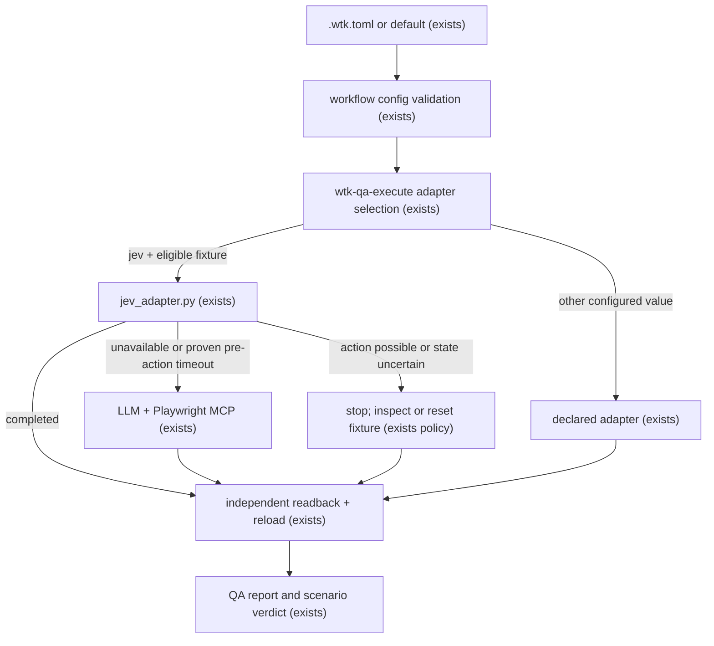

# Default Jev browser QA

## Problem

WTK 1.1.0 ships a Jev adapter but gives consuming projects no machine-readable way to select it.
The QA instructions require an explicit declaration while `.wtk.toml` rejects every QA key, so an
operator cannot activate the shipped capability through the workflow's configuration surface.
Fallback metadata also does not distinguish a navigation timeout that is safe to continue from a
failure after a browser action may have changed fixture state.

When this ships, eligible browser fixture journeys use an automatic Jev-first chain by default,
operators can select `auto` or one of five stable adapter names in `.wtk.toml`, and the Verifier
continues through LLM + Playwright MCP only when the Jev attempt is unavailable or proven safe to
continue.

## Flow

Reuse the existing `.wtk.toml` validators, `wtk-qa-execute` selection policy, Jev wrapper, and
independent oracle instead of adding another configuration file or browser runner.

## Impact

| Front | What changes |
| --- | --- |
| domain | new term: `browser_adapter` - stable logical selection for browser QA; `jev` maps internally to the installed Jev Ultrafast implementation |
| configuration | `.wtk.toml` accepts optional `[qa] browser_adapter`; absence resolves to `auto` |
| QA execution | eligible non-consequential fixture journeys try Jev first; safe fallback is executable Verifier routing rather than metadata alone |
| failure evidence | Jev failures identify whether fallback is safe and whether a product action may have occurred |
| stored data | nothing to migrate; checkout-local configuration remains consumer-owned and existing files without `[qa]` receive the new `auto` default |

## Relations

None - no stored-data shape change.

## Surface

None - no HTTP route or package-export signature changes. The public configuration contract is
frozen in `dx.md` and Landing; the existing internal adapter result gains bounded failure metadata.

## Landing

| One-way door | Literal shape | Alternative rejected |
| --- | --- | --- |
| Public browser-adapter configuration | `[qa] browser_adapter = "auto"`; valid values are `auto`, `jev`, `playwright-mcp`, `orca`, `maestri`, `manual`; `auto` walks Jev -> Playwright MCP -> one declared IDE-native adapter -> manual | defaulting to `jev` makes `auto` duplicate its fallback behavior; `jev-ultrafast` exposes an implementation package |
| Automatic fallback boundary | Jev unavailable or a timeout proven before any product action routes to LLM + Playwright MCP; possible action or uncertain state stops until independent inspection/reset | replaying every failed attempt can duplicate mutations; never falling back preserves the 1.1.0 timeout failure |

- Nothing else in this change is hard to reverse.

## Criteria

### S1: Select the configured browser QA adapter (P1)

An operator gets one stable configuration key and predictable default selection.

**Acceptance Criteria**

1. WHEN `[qa].browser_adapter` is absent THEN WTK SHALL resolve the browser adapter to `auto`.
2. WHEN `[qa].browser_adapter` is `auto`, `jev`, `playwright-mcp`, `orca`, `maestri`, or `manual` THEN WTK SHALL preserve and resolve that exact logical value.
3. IF `[qa].browser_adapter` contains any other value or any unknown `[qa]` key THEN both workflow configuration validators SHALL reject it and list the six valid values without reading or printing credentials.
4. WHEN the configured value is `auto` THEN `wtk-qa-execute` SHALL try Jev, then LLM + Playwright MCP, then exactly one declared IDE-native adapter (`orca` or `maestri`), then manual.
5. WHEN the configured value is not `auto` THEN `wtk-qa-execute` SHALL select only that logical adapter, mapping `jev` internally to Jev Ultrafast without accepting `jev-ultrafast` as a public value.
6. WHEN an existing consumer `.wtk.toml` has no `[qa]` table THEN adoption and agent synchronization SHALL preserve its bytes while QA selection resolves to `auto`.

**Independent test:** Validate absent, five valid, invalid, and unknown-key configurations through
the Python and installer-side parsers, then reload an adopted consumer and read the resolved QA
selection independently.

### S2: Continue the automatic chain safely after Jev cannot complete (P1)

An eligible browser fixture uses Jev first and reaches LLM + Playwright MCP only when continuation
cannot replay a possible product mutation.

**Acceptance Criteria**

7. WHERE the configured adapter is `auto`, WHEN the journey is a declared non-consequential fixture and the existing Jev prerequisites are ready, THEN `wtk-qa-execute` SHALL invoke the Jev adapter before another browser adapter.
8. IF Jev is unavailable during automatic preflight THEN `wtk-qa-execute` SHALL select LLM + Playwright MCP, followed by the one declared IDE-native adapter (`orca` or `maestri`), then manual.
9. IF Jev raises a timeout during `auto` and the adapter can prove that no product action began THEN the result SHALL identify a pre-action timeout as safe for fallback and `wtk-qa-execute` SHALL continue through LLM + Playwright MCP against an isolated fixture whose state is independently known.
10. IF a Jev failure occurs after a product action began or the action state is uncertain THEN the result SHALL forbid automatic fallback and `wtk-qa-execute` SHALL require independent inspection or fixture reset before another driver acts.
11. WHEN Jev or a fallback driver reports completion THEN the scenario SHALL remain non-passing until the expected observable matches through an independent read path after reload.
12. The configuration and adapter evidence SHALL keep provider credentials, cookies, authorization values, reusable tokens, and raw exception text out of `.wtk.toml`, stdout, stderr, evidence, and QA reports.

**Independent test:** Drive stubbed unavailable, typed pre-action timeout, post-action timeout,
ambiguous failure, and completed paths through the adapter boundary; independently assert the
selected fallback, no replay on unsafe paths, secret-free evidence, and oracle-owned verdict.

## Security Surfaces

| ID | Surface | Control | Requirements |
| --- | --- | --- | --- |
| S1 | public configuration and browser-selection behavior | strict enum/default validation in both config readers | SEC-001, SEC-002 |
| S5 | TypeSafe, Gateway, browser-session and MCP credentials | process environment only; redacted allowlisted output | SEC-003 |
| S6 | untrusted config, page/provider output, exception data and evidence | closed schema, bounded classification, no raw exception output | SEC-001, SEC-003, SEC-004 |
| S9 | Jev, Browser Harness and Playwright MCP providers | explicit failure phase and fail-closed fallback eligibility | SEC-004, SEC-005 |
| S11 | dedicated browser process and replay boundary | isolated fixture, no automatic post-action replay, independent state read/reset | SEC-005, SEC-006 |

## Traceability

| ID | Slice | Criteria | Status |
| --- | --- | --- | --- |
| JDF-01 | S1 | 1, 2, 3 | Built (C1-C2) |
| JDF-02 | S1 | 4, 5, 6 | Built (C3-C4) |
| JDF-03 | S2 | 7, 8, 9 | Built (C4-C5) |
| JDF-04 | S2 | 10, 11, 12 | Built (C6-C7) |

## Out of scope

| Excluded | Why |
| --- | --- |
| Installing Jev Ultrafast, Browser Harness, Playwright MCP, or a browser | consuming projects continue to own optional runtime tooling |
| Consequential or production journeys through Jev | the current safe boundary remains non-consequential fixtures |
| Retrying a failed Jev call | fallback uses another declared driver only after a safe boundary; Jev `Agent.run()` remains single-call |
| Configurable fallback ordering or timeout thresholds | `auto` owns one fixed safe order and upstream timeout classification without extra policy knobs |
| Live provider/browser proof in this source repository | it has no browser application or authorized provider credentials; consumers own live evidence |

## Assumptions

| Assumption | Chosen default | Rationale | Confirmed? |
| --- | --- | --- | --- |
| Existing isolation requirements | dedicated CDP and non-consequential fixture requirements remain unchanged | the user approved proceeding after these safety limits were stated | y |
| Config schema version | keep `.wtk.toml` version `3` and add an optional validated table | absence has a defined new default and no obsolete key is retained | n |

**Open questions:** none - all choices have defaults above.

## Observable

| Surface | Decision | Landing |
| --- | --- | --- |
| `.wtk.toml [qa].browser_adapter` | name, type, default, valid values | AC 1-5 |
| `.wtk.toml [qa].browser_adapter` | invalid value and unknown-key error | AC 3 |
| existing `.wtk.toml` without `[qa]` | adoption and resolution | AC 6 |
| Jev execution | eligible automatic path | AC 7 |
| Jev preflight unavailable | fallback order | AC 8 |
| Jev timeout | safe pre-action continuation | AC 9 |
| Jev failed/uncertain attempt | no replay before inspection/reset | AC 10 |
| all driver completion | verdict authority | AC 11 |
| configuration and evidence | secret/error disclosure boundary | AC 12 |

## Sources

- User decision in this conversation - `auto` follows Jev, Playwright MCP, the IDE-native Orca or Maestri adapter, then manual; direct adapter values remain available.
- `.specs/STATE.md` AD-002 - consuming projects own runtime tooling and the Verifier remains provider-neutral.
- `docs/qa/reports/2026-09-19-cua-jev-benchmark.md` - the observed Jev Ultrafast navigation timeout occurred before model action and Playwright remained reliable.
- Official [Jev Agent source](https://github.com/browser-use/jev-ultrafast/blob/main/jev_ultrafast/agent.py) and [Browser Harness helper source](https://github.com/browser-use/browser-harness/blob/main/src/browser_harness/helpers.py), checked 2026-09-20 - initial navigation and observation happen during `Agent` construction before `Agent.run()`; Browser Harness wraps IPC timeouts as `TimeoutError` subclasses.
