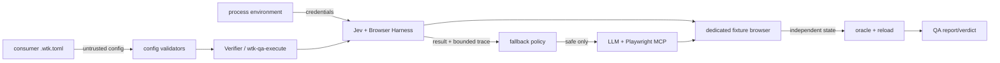

# Default Jev browser QA threat model

Status: reviewed; material assumptions were confirmed in the conversation.

## Scope, evidence snapshot, and exclusions

This model covers `.wtk.toml` browser-adapter selection, Jev Ultrafast execution, timeout/fallback
classification, LLM + Playwright MCP continuation, and independent verdict readback. Evidence is
the approved conversation decisions, the existing config validators, `wtk-qa-execute`,
`jev_adapter.py`, and the 2026-09-19 benchmarks. Dependency installation, production journeys,
personal browser profiles, and live provider calls from this source checkout are excluded.

## System model

- **Runtime:** a Verifier reads validated config, selects an adapter, executes one bounded fixture journey, and independently verifies the outcome.
- **CI/build/dev:** tracked examples and two config readers validate the same enum; no provider dependency or credential enters the package.
- **Tests:** offline collaborators cover config cases, failure phases, fallback routing, redaction, no-replay, and oracle separation.

## Assets, objectives, and attacker model

| Asset | Objective |
| --- | --- |
| delegated QA authority | only the declared adapter/fixture/goal may drive actions |
| fixture state | no duplicate mutation after uncertain failure |
| provider/browser credentials | never persist in config, evidence, diagnostics, or reports |
| adapter selection | identical deterministic result in every config reader |
| QA verdict | only independent readback after reload may pass |

A malicious local caller can edit configuration and arguments. Malicious page/provider content can
influence model state and failures. A compromised dependency may return misleading results. None can
legitimately change the charter, expand authority, select a hidden adapter, or grant pass.

## Entry points and trust boundaries

| Entry/boundary | Data | Existing control/evidence | Proposed control |
| --- | --- | --- | --- |
| `.wtk.toml` -> validators | adapter name and unknown keys | strict top-level schema exists | add identical closed `[qa]` schema/default to both readers |
| Verifier -> local/remote tools | goal, URL, environment credentials | dedicated fixture and process-only secrets | resolve stable logical adapter before dispatch |
| Jev/page -> fallback policy | status, operation trace, exception | single `Agent.run()`, bounded allowlisted trace | explicit timeout phase and fallback-safe flag; fail closed on ambiguity |
| first driver -> second driver | possibly mutated fixture | existing no-retry rule | require no product action or independent reset before continuation |
| drivers -> verdict | completion/evidence | independent readback/reload | retain as sole pass authority |

## Threats

| ID | Actor / entrypoint / abuse path | Asset | Existing control and evidence | Likelihood | Impact | Priority | Assumption |
| --- | --- | --- | --- | --- | --- | --- | --- |
| THREAT-001 | caller supplies unsupported adapter or hidden QA key | adapter selection | config readers already reject unknown top-level fields | medium - local config is editable | medium - unintended routing or blocked QA | Medium | both readers gain the same six-value enum |
| THREAT-002 | provider/browser times out after an effect and result is treated as replay-safe | fixture integrity | wrapper does not retry Jev; current fallback is metadata only | medium - partial failures are ordinary | high - duplicate mutation or misleading evidence | High | only proven pre-action timeout may continue |
| THREAT-003 | exception/page result leaks credential or browser data into evidence | credential confidentiality | recursive redaction and allowlisted trace exist | low - raw exception is currently suppressed | high - reusable credential disclosure | Medium | new classification never emits raw text |
| THREAT-004 | malicious driver reports completion and grants itself pass | verdict integrity | independent oracle/reload already required | low - existing contract is explicit | high - false release confidence | Medium | all adapters retain the same oracle rule |
| THREAT-005 | Jev default is unavailable and silently prevents QA | QA availability | unavailable result carries fallback order | medium - optional dependencies may be absent | medium - journey remains untested | Medium | Verifier executes Playwright fallback rather than only recording metadata |

## Recommended mitigations

| Threat | Owner | Change | Verification idea |
| --- | --- | --- | --- |
| THREAT-001 | config readers | one stable six-value enum, `auto` default, unknown-key rejection | shared matrix through Python and Node readers |
| THREAT-002 | Jev adapter + QA executor | classify typed timeout and action phase; forbid ambiguous/post-action fallback | pre-action/post-action/ambiguous timeout collaborators |
| THREAT-003 | Jev adapter | preserve fixed public limitation text and allowlisted evidence only | sentinel exception across every result sink |
| THREAT-004 | QA executor | retain independent read/reload for every adapter | completed + mismatch/match oracle controls |
| THREAT-005 | QA executor | invoke LLM + Playwright MCP on unavailable/safe timeout | routing contract with first-fallback assertion |

## Validated assumptions, unresolved questions, and coverage

- User-confirmed: `auto` walks Jev, Playwright MCP, the IDE-native Orca or Maestri adapter, then manual; each direct adapter value remains valid.
- User-confirmed: the default eligible browser route is Jev-first and LLM + Playwright MCP handles safe timeout fallback.
- User-confirmed through approval of the stated boundary: possible mutation requires inspection/reset before another driver acts.
- Existing confirmed boundary: Jev remains limited to dedicated non-consequential fixtures and never owns the verdict.
- No material questions remain. Live timeout exception shapes and browser reliability are not assumed; unknown exceptions fail closed.
