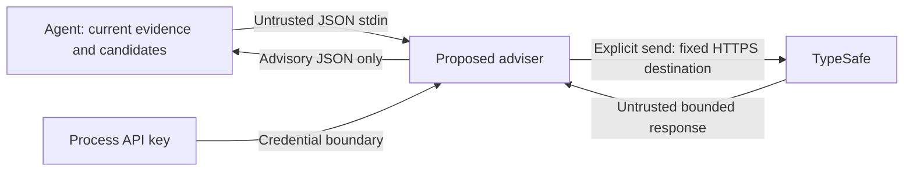

# Jev lifecycle: security model and requirements

Scope: proposed local development helper and conditional phase guidance in [plan.md](plan.md).
At specification time no implementation or live provider test exists. The user approved
advisory-only operation and non-sensitive caller summaries on 2026-09-20; rankings use that scope.

## Evidence and system model

Existing `.agents/skills/wtk-qa-execute/jev_adapter.py:1` is a browser driver, not this helper.
Existing `.wtk.toml.example:4` configures only browser QA. The proposed command and external
boundary are defined in [dx.md](dx.md); their controls are requirements, not observed code.

Runtime is a local command under the host agent's identity, stdin → TypeSafe HTTPS → JSON stdout.
Build/install ships the helper through the existing core package without a credential.
Tests use synthetic decisions and a fake provider; live smoke testing is separate and optional
when a credential is absent. No application runtime, browser, CI deployment or public server changes.

## Assets and actors

Assets: API key confidentiality, project-context confidentiality, workflow authority, inference budget.
The legitimate agent chooses bounded evidence and candidate actions. An untrusted source author
can influence evidence text; a faulty or malicious provider can control response bytes. Neither
is assumed to control the helper implementation, process environment or host permission policy.
An attacker already controlling the local process is outside this feature's boundary.

## Trust boundaries

The helper reads no implicit context and executes no returned action. Disclosure of arbitrary
free text remains the caller's responsibility; provider retention terms have not been established.

## Threats and abuse cases

| Threat / abuse | Actor and path | Asset | Existing control | Likelihood / impact / priority |
| --- | --- | --- | --- | --- |
| THREAT-001 / ABUSE-001 | Evidence or provider suggests bypassing approval, marking a test passed, or running a shell payload | Workflow authority | Existing role separation; new helper has no controls implemented yet | Medium: untrusted prose is expected / high if consumed as authority / high |
| THREAT-002 / ABUSE-002 | Redirect or provider error leaks credentials; caller supplies private source context | Key and project data | Existing QA redaction applies only to QA, not this new boundary | Medium: ordinary errors or excessive context / high if secrets leave process / high |
| THREAT-003 / ABUSE-003 | Huge input, slow response or repeated retries exhaust resources | Inference budget and host availability | None in proposed helper yet | Medium: provider faults plausible / medium for local bounded task / medium |
| THREAT-004 / ABUSE-004 | A valid recommendation is reused after evidence or candidates change | Decision integrity | Existing artifacts remain authoritative | Medium: iterative edits common / medium under advisory use / medium |

## Security requirements and proposed mitigations

| ID | Abuse | Observable outcome | Owner |
| --- | --- | --- | --- |
| SEC-001 | ABUSE-001 | The helper SHALL execute no action or artifact mutation for any returned selection; agents retain existing gate and permission rules | Helper and shared adviser guidance; AC 7 |
| SEC-002 | ABUSE-002 | The helper SHALL use one fixed HTTPS recipient, refuse redirects, read no ambient context and print no credentials or raw error bodies | Helper; AC 8–9 |
| SEC-003 | ABUSE-003 | The helper SHALL enforce request/response byte bounds, a 20-second deadline, validated values and at most one request | Helper; AC 4–6 |
| SEC-004 | ABUSE-004 | The result SHALL identify its exact input and guidance SHALL reject stale recommendations | Helper and caller; AC 10, 12 |

## Negative-test seeds

| Requirements | Setup and action | Expected outcome and legitimate control |
| --- | --- | --- |
| SEC-001 | Supply an option description containing a shell payload and a confidence-1 response | JSON advice only; no process launch, artifact edits or verdict; ordinary option still produces advice |
| SEC-002 | Inject a redirect or a credential-bearing error body with a sentinel key | No second destination request and no sentinel output; normal fixed-endpoint success remains accepted |
| SEC-003 | Submit oversize/malformed JSON; return malformed, oversize, out-of-range or stalled responses | Defined invalid/unavailable status, no advice and at most one request; valid bounded response succeeds |
| SEC-004 | Change evidence, phase or an option after the initial request | Hash changes; guidance directs re-evaluation; identical normalized input yields identical hash |

## Assumptions, coverage and open questions

All controls are proposed. This is an architectural assessment, not a vulnerability report.
Advisory authority is approved; autonomous execution would require a new model
of action authorization. Non-sensitive summaries are the approved disclosure policy; private
consumer data needs its own allowed-scope decision. No secret discovery or live inference occurred.

Covered: stdin, external response, credential egress, output consumption, staleness and resource bounds.
Excluded: tenant identity, browser cookies, persistence and web rendering because this design has
none; package supply-chain controls remain the existing installer responsibility.
