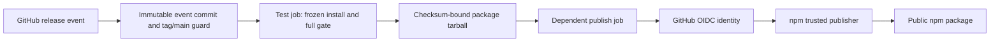

# Automatic npm publishing

## Problem

Publishing `workflow-toolkit` to npm requires a maintainer's local npm session. The 1.4.1 launch stopped at an npm 401 until a maintainer published the package manually, while the GitHub release remained a draft. This leaves two release surfaces to coordinate by hand. No frequency or time-cost measurement is available.

For future versions, publishing a stable GitHub release should publish the corresponding package without a stored npm write token.

## Flow

Reuse the existing GitHub release, `package.json`, Bun lockfile, and `test:all` gate rather than adding a release manager.

1. A maintainer publishes a stable `vX.Y.Z` GitHub release; the GitHub `release.published` event enters the new release workflow (door 1).
2. An unprivileged test job checks out the immutable event commit, confirms that its tag still resolves to that commit and that the commit belongs to `main`, and matches `X.Y.Z` against the checked-out `package.json` before executing package code.
3. The test job installs the declared toolchain and frozen dependencies, runs the existing `bun run test:all` gate, and produces a checksum-bound package tarball from the unchanged checkout.
4. After the test job passes, a dependent publish job rechecks release identity, verifies the tarball checksum and manifest, then uses the package's trusted GitHub Actions OIDC identity (door 2) to publish that tarball to npm as public `latest`; npm records provenance. The publish job does not install project dependencies or run package tests.
5. The GitHub Actions run records success or failure. A failed npm publication remains visible for maintainer action; it does not alter the GitHub release.

## Impact

| Front | What changes |
| --- | --- |
| Release behavior | Publishing a future stable GitHub release starts npm publication once from its tag. |
| Package metadata | `package.json` gains the exact public GitHub repository URL required by npm trusted publishing. |
| Operations | A package owner configures one npm trusted publisher for `antoniofulg/workflow-toolkit` and the workflow filename, with direct publish allowed. This external setup blocks go-live. |
| Stored data | No migration; npm versions remain immutable and 1.4.1 is already published manually. |

## Relations

None - no stored-data shape change.

## Surface

None - no HTTP route or consumer CLI signature changes. The release event and published package are described in Flow and Criteria.

## Landing

| One-way door | Literal shape | Alternative rejected |
| --- | --- | --- |
| Release authority | `release.published` for stable `vX.Y.Z` releases starts publication. | Publishing on a merge or tag push would turn ordinary delivery into a public package release without the deliberate GitHub release action the user selected. |
| npm publisher identity | Trust `antoniofulg/workflow-toolkit` and `.github/workflows/publish.yml` for `workflow-toolkit` direct publishing; use GitHub OIDC with `id-token: write`, without a stored npm write token. | A long-lived `NPM_TOKEN` would remain reusable after a workflow run and needs secret rotation. |
| Artifact source | Check out the published tag and require its commit to be reachable from `main`; package version must equal the tag. | Checking out moving `main` could publish bytes different from the release commit. |
| Privilege boundary | Keep dependency installation, tests, and tarball creation in a `contents: read` test job; make the dependent publish job the only job with `id-token: write`, and publish only the verified tarball. | Giving the test job OIDC access would let dependency or test code request npm authority before the gate completes. |

## Criteria

### S1: Publish a stable GitHub release to npm (P1)

A maintainer can publish a stable release and observe one package publish attempt for that exact version.

**Acceptance Criteria**

1. WHEN a stable GitHub release with tag `vX.Y.Z` is published for a commit reachable from `main`, THEN the workflow SHALL check out that tag and start one npm publish attempt for `workflow-toolkit@X.Y.Z` after validation.
2. IF the release is a prerelease, THEN the workflow SHALL skip npm publication without changing the npm `latest` tag.
3. IF the tag is not `vX.Y.Z`, its commit is not reachable from `main`, or `package.json` names another package or version, THEN the workflow SHALL fail before installing dependencies or calling `npm publish`.
4. WHEN release identity passes, THEN the workflow SHALL install dependencies from the frozen Bun lockfile and run `bun run test:all` on the tagged commit.
5. IF the test gate fails, THEN the workflow SHALL fail without calling `npm publish`.
6. WHEN the gate passes, THEN the workflow SHALL publish the checked-out `workflow-toolkit@X.Y.Z` to the public npm registry using the configured OIDC trusted publisher, with npm provenance and no repository npm write token.
7. IF npm rejects publication, including an already published version or unavailable trusted publisher, THEN the workflow SHALL report failure without retrying publication or changing the GitHub release.
8. The publishing job SHALL grant only `contents: read` and `id-token: write` permissions.
9. The publishing job SHALL run on a GitHub-hosted runner with Node `22.14.0+` and npm CLI `11.5.1+`.
10. The package manifest SHALL declare `https://github.com/antoniofulg/workflow-toolkit` as its repository URL.

**Independent test:** Inspect a release workflow run for a future unpublished version: the tag, checked-out commit, test result, npm package version, and provenance match; negative inputs stop before publish.

## Traceability

| ID | Slice | Criteria | Status |
| --- | --- | --- | --- |
| PUB-01 | S1 | 1, 2, 3, 4, 5, 6, 7, 8, 9, 10 | Pending |

## Out of scope

| Excluded | Why |
| --- | --- |
| Automatic version bumps or GitHub release creation | A human publishing the GitHub release remains the release authorization step. |
| Republish or re-trigger `workflow-toolkit@1.4.1` | npm already has 1.4.1; its version cannot be overwritten. |
| Prerelease npm channels | Stable releases use `latest`; a distinct prerelease policy has not been requested. |
| Automatic rollback of an already published GitHub release | npm publication can fail after GitHub publication; the failed run remains visible for correction. |

## Assumptions

| Assumption | Chosen default | Rationale | Confirmed? |
| --- | --- | --- | --- |
| npm package settings | The package owner can add the exact trusted publisher with direct `npm publish` permission after the workflow is merged. | npm configuration is outside this repository; no trusted-publisher readback is yet available. | n |

**Open questions:**

| # | Kind | Question | Until answered |
| --- | --- | --- | --- |
| 1 | blocks go-live | Has the npm package owner configured trusted publishing for `antoniofulg/workflow-toolkit` and `publish.yml` with direct publish allowed? | The workflow can be merged and validated locally, but no release may rely on it for npm publication. |

## Observable

| Surface | Decision | Landing |
| --- | --- | --- |
| GitHub release event | Stable `vX.Y.Z` triggers publication; prerelease does not. | Criteria 1, 2 |
| Release tag | Invalid format, non-main commit, or manifest mismatch fails before executable package setup. | Criterion 3 |
| Test and publishing jobs | Frozen dependencies and gate run without OIDC; the dependent publish job verifies the tarball, uses OIDC, public `latest`, and provenance. | Criteria 4, 5, 6, 8, 9, 10 |
| Publishing job | Partial failure and duplicate version result in a failed run with no automatic GitHub release mutation. | Criterion 7 |
| Documentation | Maintainer sees the one-time npm trusted-publisher setup and future release steps. | Impact: Operations; Criterion 6 |
| Screen/view states | n/a - no screen is added. | n/a - no screen is added. |
| API/webhook response shape and rate limit | n/a - GitHub owns the release event and npm owns the registry API. | n/a - no API is implemented. |

## Security Surfaces

| ID | Surface | Control | Requirements |
| --- | --- | --- | --- |
| S1 | CI configuration and public release behavior | Run only from a validated stable release tag and tested package; isolate test and publish privileges. | SEC-001, SEC-003 |
| S2 | GitHub release event crosses into a publishing job | Require a tag reachable from `main` and matching the manifest. | SEC-001 |
| S5 | GitHub OIDC identity can obtain npm publishing authority | Scope trust to the exact repository and workflow; store no npm write token. | SEC-002 |
| S6 | Release tag enters shell commands | Pass tag data as a quoted value and reject non-`vX.Y.Z` input before package execution. | SEC-001 |
| S9 | GitHub Actions publishes to npm | Bind the package name and version to the release tag and checked-out commit; publish only the verified tarball from the dependent test job. | SEC-003 |
| S11 | GitHub-hosted build process | Use frozen dependencies and a gate in a job without OIDC before the publish step; the publish job runs no project dependency or test scripts. | SEC-003 |

## Security Model

Assets are the public package bytes, npm `latest` pointer, provenance, and npm publishing authority. The legitimate actor can publish a GitHub release; an actor able to propose code or a malformed release tag cannot obtain npm authority merely by opening a pull request. Repository release permissions and npm package-owner rights are external controls, not proved by this plan.

| Threat | Actor and path | Asset and impact | Proposed control | Linked requirement |
| --- | --- | --- | --- | --- |
| THREAT-001 / ABUSE-001 | A release targets an unreviewed commit or mismatched version. | Wrong package bytes are published under a valid version. | Tag must resolve to a commit reachable from `main` and match `package.json`. | SEC-001 |
| THREAT-002 / ABUSE-002 | A crafted tag reaches a shell command. | Command execution in the publishing runner. | Strict tag format and quoted data before package setup. | SEC-001 |
| THREAT-003 / ABUSE-003 | A reusable npm token leaks from CI. | Subsequent unauthorized package publication. | OIDC trust for one repository/workflow; no stored write token. | SEC-002 |
| THREAT-004 / ABUSE-004 | Untested or substituted dependencies run before publish, or dependency/test code requests publication authority. | Package or provenance integrity loss, or premature npm publication. | Frozen dependency install and complete gate run without OIDC; a dependent publish job accepts only the checksum-bound tarball and runs no project dependency or test scripts. | SEC-003 |

Security requirements: SEC-001 is Criteria 1-3; SEC-002 is Criteria 6 and 8; SEC-003 is Criteria 4-6, 9, and 10. Negative seeds: prerelease, malformed tag, non-main commit, wrong version, gate failure, and missing npm trust must not publish; a valid stable release is the authorized control. This is a provisional design threat model, not a vulnerability finding: the npm trust setting still needs readback. The first live npm publication is the end-to-end OIDC proof; dry runs do not exercise npm trust.

## Sources

- User request and confirmed trigger choice in this conversation - publishing a GitHub release starts npm publication.
- [npm trusted publishers](https://docs.npmjs.com/trusted-publishers/) - OIDC setup, runtime minimums, workflow identity, and provenance.
- [GitHub Actions release event](https://docs.github.com/en/actions/reference/workflows-and-actions/events-that-trigger-workflows) - `release.published` behavior and default-branch workflow requirement.
