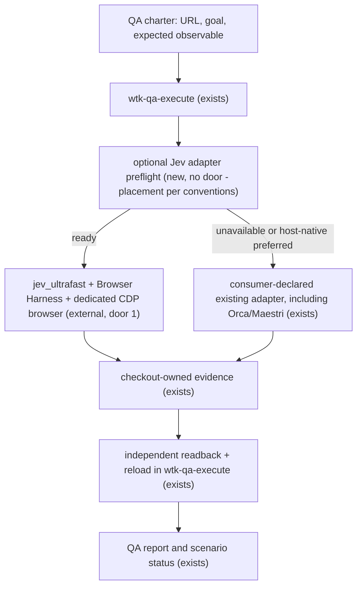

# Optional Jev QA Adapter

Sources:

- conversation - commits to one observable slice: use Jev Ultrafast when configured, otherwise retain the existing QA path; Jev never supplies the QA verdict
- `.agents/skills/wtk-qa-execute/SKILL.md` - owns adapter selection, public-interface walking, independent readback, evidence, and limitations
- `docs/qa/README.md` - confirms this source pack has no browser surface and consuming projects own their QA adapters and runtimes
- `.specs/STATE.md` AD-002, AD-033, AD-036, AD-037 - keeps adapter choice consumer-owned, optional integrations honest on fallback, Workflow Toolkit naming current, and feature artifacts transient
- `https://github.com/browser-use/jev-ultrafast` - current `Agent(url, goal)` interface, Browser Harness dependency, structured action loop, and requirement for independent outcome verification
- `https://github.com/browser-use/browser-harness` - supports dedicated local or remote CDP endpoints through `BU_CDP_URL` / `BU_CDP_WS`, including a separately launched headless Chromium
- `https://docs.typesafe.ai/introduction/quickstart` - direct TypeSafe key and structured Jev decision contract
- `https://vercel.com/ai-gateway/models/jev` - Vercel model identity and Gateway key boundary
- installed Orca browser and Maestri Portal guides - host-native accessibility snapshots, element refs, and browser actions remain existing adapter options; Jev Ultrafast does not natively implement either protocol

## Problem

Consuming web projects can declare only their existing browser, API, CLI, mobile, or manual QA adapter. An operator who already has TypeSafe and Vercel AI Gateway credentials has no packaged, bounded way to try Jev Ultrafast for adaptive browser execution while preserving Workflow Toolkit's existing fallback, independent-verification, evidence, and secret-handling rules. No measured usage or failure volume was supplied; this is a controlled optional-capability pilot.

## Out of scope

| Excluded | Why |
| --- | --- |
| Linear-ticket qualification and Orca pre-spawn routing | The unattended runner is roadmap work and has no current caller seam to integrate here |
| Installing Jev Ultrafast, Browser Harness, Chrome, or an AI SDK | AD-002 and the QA contract leave framework/tool adoption with the consuming project |
| Replacing the Verifier or independent outcome oracle | Jev drives the journey; existing QA authority decides the verdict |
| Live browser validation in this source repository | `docs/qa/README.md` confirms there is no browser application to exercise here |
| Vercel AI Gateway as the Jev decision backend | Current Jev Ultrafast calls TypeSafe directly; v1 uses Gateway only for its text helper |
| Generic text-model-provider configuration | V1 binds the already chosen TypeSafe + Vercel combination instead of adding unused provider abstraction |
| Personal-profile browser attachment | V1 requires a consuming-project-declared dedicated QA browser/profile to contain credentials and unrelated sessions |
| Jev bridges for Playwright MCP, Orca Browser, or Maestri Portal | Current Jev Ultrafast uses Browser Harness/CDP; host-native browsers remain existing LLM-driven adapters and a protocol bridge is separate work |

## Assumptions

| Assumption | Chosen default | Rationale | Confirmed? |
| --- | --- | --- | --- |
| Browser identity | Require the consuming project to declare a dedicated QA browser/profile before Jev is ready | User confirmed dedicated QA isolation; ordinary signed-in profiles expand credential and session exposure | y |
| Jev browser transport | Prefer a dedicated headless Chromium exposed through `BU_CDP_URL` or `BU_CDP_WS`; allow a dedicated headed QA profile only when the journey requires it | Browser Harness supports explicit CDP endpoints, while Jev Ultrafast has no native Playwright MCP, Orca Browser, or Maestri Portal transport | y |
| Host-native browser fallback | Use the consuming project's declared Orca Browser or Maestri Portal adapter when that host can complete the journey; the LLM Verifier drives it without pretending Jev is involved | Both expose snapshot/ref/action loops already usable by an agent, and no translation bridge is needed for fallback | y |
| Provider split | `TYPESAFE_API_KEY` drives Jev decisions; `AI_GATEWAY_API_KEY` is aliased internally for the Vercel-hosted text helper | Matches the available keys and current Jev Ultrafast interfaces without duplicating a secret | y |
| Environment loading | Read process environment only; the caller or secret manager loads any central env file | One central secret source can serve every worktree without teaching the adapter dotenv parsing | y |
| Existing fallback | The consuming project's already-declared adapter remains the fallback and default when Jev is unavailable | AD-002 makes adapter choice consumer-owned and forbids framework installation | y |
| Upstream invocation | Use the documented `jev_ultrafast.Agent(url, goal)` library API after re-verifying it at Build | Reuse is smaller and safer than recreating its browser policy; the package is not installed in this checkout | n |

**Open questions:** none - all choices have concrete defaults above.

## Criteria

### S1: Execute browser QA through optional Jev with safe fallback (P1)

**Acceptance Criteria**

1. WHERE a consuming project declares the Jev adapter and a dedicated headless-CDP or headed QA browser/profile, WHEN `TYPESAFE_API_KEY`, `AI_GATEWAY_API_KEY`, Jev Ultrafast, and Browser Harness are available, THEN the adapter SHALL execute one supplied URL and natural-language goal and return `adapter`, `status`, `evidence`, and `limitation` fields without returning either key.
2. IF any required key, declared browser/profile, Jev Ultrafast module, or Browser Harness executable is unavailable, THEN the adapter SHALL return status `unavailable`, name every missing prerequisite without secret values, and allow `wtk-qa-execute` to select the consuming project's existing adapter.
3. WHEN Jev Ultrafast reports `DONE`, THEN `wtk-qa-execute` SHALL keep the scenario non-passing until the expected observable is confirmed through an independent read path after reload.
4. IF browser execution or either provider fails after an interaction begins, THEN the adapter SHALL return status `failed`, preserve the bounded attempt evidence, and SHALL NOT automatically replay a browser mutation.
5. The adapter SHALL resolve the text-helper credential from `AI_GATEWAY_API_KEY` in process memory and SHALL NOT require a duplicate stored `TEXT_MODEL_API_KEY`.
6. IF the evidence destination resolves outside the checkout-owned disposable evidence root or traverses a symbolic link, THEN the adapter SHALL reject the run before the first write and return status `invalid`.
7. WHEN a QA report records the journey, THEN it SHALL name the adapter actually used, the exact execution path, evidence, fallback reason or limitation, and the independent verification result.
8. IF page content, model output, or tool metadata asks for an action outside the supplied goal and declared QA browser scope, THEN the adapter SHALL not execute or disclose that action and SHALL return status `blocked` with secret-free evidence.

**Independent test:** In a disposable consumer fixture, run the adapter contract with stubbed Jev Ultrafast and Browser Harness collaborators for the ready, unavailable, failed, invalid, blocked, and `DONE` paths; independently inspect the emitted result/evidence and prove only the external oracle can produce a passing scenario.

## Security Surfaces

| ID | Surface | Control | Requirements |
| --- | --- | --- | --- |
| S1 | Optional runtime adapter, environment configuration, and packaged QA behavior | Explicit preflight, bounded statuses, no installed runtime dependency | SEC-004, SEC-005 |
| S2 | Adapter CLI/process input from the QA Verifier | Closed input schema and rejection before execution | SEC-003, SEC-006 |
| S5 | TypeSafe and Vercel API keys plus browser-session credentials | Process-environment ownership, redaction, dedicated QA profile | SEC-001, SEC-002 |
| S6 | Untrusted goal/page/model content and evidence filesystem destination | Goal-bound actions, destination containment and symlink rejection | SEC-003, SEC-006 |
| S9 | TypeSafe, Vercel AI Gateway, Jev Ultrafast, and Browser Harness | Preflight, explicit failure state, no silent success or provider substitution | SEC-004, SEC-005 |
| S11 | External headless-CDP or headed browser process and checkout-owned QA runtime | Dedicated declared profile/endpoint, bounded run, no mutation replay | SEC-002, SEC-007 |

## Traceability

| ID | Slice | Criteria | Status |
| --- | --- | --- | --- |
| JQA-01 | S1 | 1, 5, 7 | In checks |
| JQA-02 | S1 | 2 | In checks |
| JQA-03 | S1 | 3 | In checks |
| JQA-04 | S1 | 4 | In checks |
| JQA-05 | S1 | 6 | In checks |
| JQA-06 | S1 | 8 | In checks |

## Observable

| Surface | Decision | Landing |
| --- | --- | --- |
| command `jev_adapter.py` | required input | AC 1 - one URL, one natural-language goal, and one checkout-owned evidence destination |
| command `jev_adapter.py` | output shape | AC 1 - `adapter`, `status`, `evidence`, and `limitation` |
| command `jev_adapter.py` | successful execution | AC 1 - status `completed`; this does not mean QA `pass` |
| command `jev_adapter.py` | unavailable prerequisites | AC 2 - status `unavailable` and existing-adapter fallback |
| command `jev_adapter.py` | provider/browser partial failure | AC 4 - status `failed`, bounded evidence, no mutation replay |
| command `jev_adapter.py` | invalid evidence destination | AC 6 - status `invalid` before any write |
| command `jev_adapter.py` | out-of-scope requested action | AC 8 - status `blocked` without action or disclosure |
| command `jev_adapter.py` | verbosity | existing - machine-readable result on stdout; diagnostics remain secret-free |
| command `jev_adapter.py` | idempotency | n/a - browser journeys may mutate; AC 4 forbids automatic mutation replay |
| command `jev_adapter.py` | authorization | existing - the consuming project's QA profile owns reachable identities and public entrypoints |
| host-native browser adapter | Orca/Maestri availability | existing - the consuming project may select its declared internal tool instead of Jev; no Jev protocol bridge is implied |

## Flow

Reuse `wtk-qa-execute` for adapter selection, evidence, limitations, independent readback, and verdicts; reuse Jev Ultrafast for browser policy instead of implementing a second browser agent.

## Relations

None - no stored-data shape change.

## Surface

None - the Python helper is internal to the existing `wtk-qa-execute` adapter contract; it adds no public CLI verb, package export, or provider config key.

## Landing

| One-way door | Literal shape | Alternative rejected |
| --- | --- | --- |
| 1. Packaged optional browser-adapter precedent | `wtk-qa-execute` may ship an optional helper that reuses a consumer-installed adapter, installs nothing, fails closed, and leaves adapter choice plus verdict authority with the consuming project | Making Jev the default or bundling its dependencies would violate AD-002 and make non-browser or credential-free consumers pay for it |

- Nothing else in this change is hard to reverse.

## Impact

| Front | What changes |
| --- | --- |
| domain | new term: `Jev adapter` - optional browser journey driver under `wtk-qa-execute`; it is not a Verifier or oracle |
| public QA behavior | a consuming project may declare the packaged Jev helper; current browser/API/CLI/mobile/manual adapters remain valid and are selected on fallback |
| package | the existing recursively packaged `wtk-qa-execute` skill gains its helper and instructions; installer module membership does not change |
| stored data | nothing to migrate; raw attempt evidence remains disposable and QA reports/scenario statuses retain their existing schemas |

## Build state

Build uses `.agents/skills/wtk-qa-execute/jev_adapter.py` as the optional process boundary. It
reuses the consumer-installed `jev_ultrafast.Agent(url, goal)`, aliases the Gateway text-helper key
only in process memory, validates checkout-owned evidence before any write, and emits a completed
driver result that remains unverified until the existing independent oracle runs. No runtime
dependency, installer action, browser bridge, or live provider/browser call was added.
