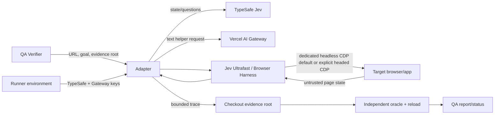

# Optional Jev QA Adapter Threat Model

Status: reviewed with dedicated QA browser/profile isolation confirmed by the user.

## Scope, evidence, and exclusions

This model covers the optional Python QA adapter from local invocation through TypeSafe, Vercel AI Gateway, Jev Ultrafast, Browser Harness, a consuming project's dedicated CDP browser, ordered fallback through Playwright MCP then declared Orca/Maestri/manual adapters, and checkout-owned evidence. Evidence is the conversation, `.agents/skills/wtk-qa-execute/SKILL.md`, `docs/qa/README.md`, current upstream Jev Ultrafast, Browser Harness, and Playwright MCP documentation, and the feature plan. This checkout has no live browser surface or installed upstream runtime, so deployment controls are proposed rather than observed. Production use, Linear/Orca qualification, and dependency installation are excluded.

## System model

- **Runtime:** QA Verifier invokes the optional adapter; the adapter validates input/environment, drives Jev Ultrafast and Browser Harness, writes bounded evidence, then hands results to existing independent verification.
- **CI/build/dev:** the source pack ships the helper inside the quality module but installs no external browser/provider dependency and makes no paid calls in tests.
- **Tests:** offline stubs exercise preflight, terminal statuses, allowlisted evidence/redaction, path containment, consequential-journey fallback, one-call failure behavior, and oracle separation.

## Assets, objectives, and attacker model

| Asset | Objective |
| --- | --- |
| TypeSafe/Gateway keys | confidentiality; use only for the declared provider request |
| QA browser credentials/session | confidentiality and integrity; no unrelated-profile access |
| delegated QA authority | integrity; actions remain inside goal, target, identity, and charter |
| target test data | integrity; no automatic duplicate mutation |
| evidence/report | integrity and confidentiality; exact attempt, no secret leakage |
| checkout filesystem | integrity; evidence cannot escape its disposable root |

Attackers may control target page content, malformed local arguments, or compromised/misleading external results. They may attempt prompt injection, path traversal, scope expansion, false completion, or retry amplification. They cannot legitimately authorize new origins, identities, paths, or production access; those stay application/runner decisions.

## Entry points and trust boundaries

| Entry/boundary | Data | Enforcement/evidence |
| --- | --- | --- |
| CLI to adapter | URL, goal, evidence destination | proposed closed validation in AC 1, 6, 8 |
| environment to provider clients | two API keys | proposed minimum child environment and SEC-001 |
| charter/browser declaration to adapter | consequence classification, mode, CDP endpoint | reject unsafe work before `Agent` construction under SEC-002, SEC-006 |
| page/provider to browser policy | page state, target candidates, decisions | untrusted but confined to a dedicated non-consequential fixture; no claim of semantic pre-action mediation |
| adapter to filesystem | traces and errors | containment/symlink rejection in SEC-003 |
| driver to verdict | `DONE` and trace | independent readback/reload in AC 3 and SEC-005 |

## Threats

| ID | Actor / entrypoint / abuse path | Asset | Existing control and evidence | Likelihood | Impact | Priority | Assumption |
| --- | --- | --- | --- | --- | --- | --- | --- |
| THREAT-001 | Unsafe charter/browser selection gives Jev authority over consequential or personal-session work | delegated authority, browser session | Human-confirmed dedicated CDP requirement plus preflight rejection of consequential work; page content remains untrusted inside non-consequential fixtures | low - unsafe declarations are rejected before agent construction | high - bypass could expose or mutate scoped data | Medium | charter classification and dedicated endpoint required |
| THREAT-002 | Local caller supplies traversal/symlink evidence destination | checkout filesystem | WTK requires checkout-owned evidence; path enforcement is proposed | medium - caller controls the argument | medium - foreign file overwrite/disclosure | Medium | adapter writes evidence |
| THREAT-003 | Error/trace includes API key, cookie, or authorization data | credentials | Existing QA guidance forbids secret evidence; adapter redaction is proposed | medium - provider/browser errors may echo context | high - reusable credential disclosure | High | upstream exceptions may contain request metadata |
| THREAT-004 | Provider/browser fails after interaction and wrapper restarts `Agent.run()` | target test data | wrapper single-call enforcement proposed; upstream internal behavior remains outside the claim | medium - partial failures are ordinary | medium - duplicate test action | Medium | non-consequential fixture may mutate |
| THREAT-005 | Jev `DONE` or unavailable tooling is recorded as pass | QA verdict integrity | Existing `wtk-qa-execute` requires independent readback/reload | low - contract already rejects this | high - false release confidence | Medium | existing WTK contract remains authoritative |
| THREAT-006 | Compromised optional dependency executes with inherited secrets/filesystem/network | credentials and host | No dependency is installed by Workflow Toolkit; minimum child environment is proposed | low - requires dependency compromise | high - host-level exposure | Medium | consumer owns installed package provenance |

## Recommended mitigations

| Threat | Owner | Change | Verification idea |
| --- | --- | --- | --- |
| THREAT-001 | adapter + consumer QA profile | require non-consequential charter and dedicated CDP endpoint; use Playwright-first fallback otherwise | unsafe charter/browser matrix plus safe fixture control |
| THREAT-002 | adapter filesystem boundary | canonicalize and validate the evidence root/destination and reject symlinks before writing | traversal/symlink fault cases and contained control |
| THREAT-003 | adapter diagnostics | whitelist result fields and redact credential-shaped values from all terminal paths | sentinel keys across success/error statuses |
| THREAT-004 | adapter loop | invoke `Agent.run()` once; never restart/retry it after failure; preserve allowlisted failed evidence | failing collaborator records one `run()` call |
| THREAT-005 | `wtk-qa-execute` | retain independent reload/readback as sole pass authority and record actual adapter | `DONE` + oracle mismatch remains non-pass |
| THREAT-006 | runner/consumer | install nothing automatically, check declared availability, pass minimum environment | missing module is `unavailable`; child-env inspection omits unrelated secrets |

## Validated assumptions, open questions, and coverage

- Confirmed: the user wants an optional adapter with existing QA fallback; TypeSafe supplies Jev and Vercel supplies the text helper; environment files are loaded outside the script.
- Confirmed: v1 refuses ordinary signed-in personal/default Chrome. Jev defaults to a dedicated headless Chromium CDP endpoint; an explicit headed request requires a dedicated headed CDP endpoint.
- Confirmed: consequential journeys bypass Jev before agent construction. Playwright MCP is the first LLM-driven fallback; declared Orca, Maestri, or manual adapters follow. This feature claims no Jev protocol compatibility with those fallbacks.
- Limitation: no live browser/provider code exists here, so this model cannot prove upstream isolation or exception contents. Build must re-check current official APIs; a consuming project supplies live evidence.
